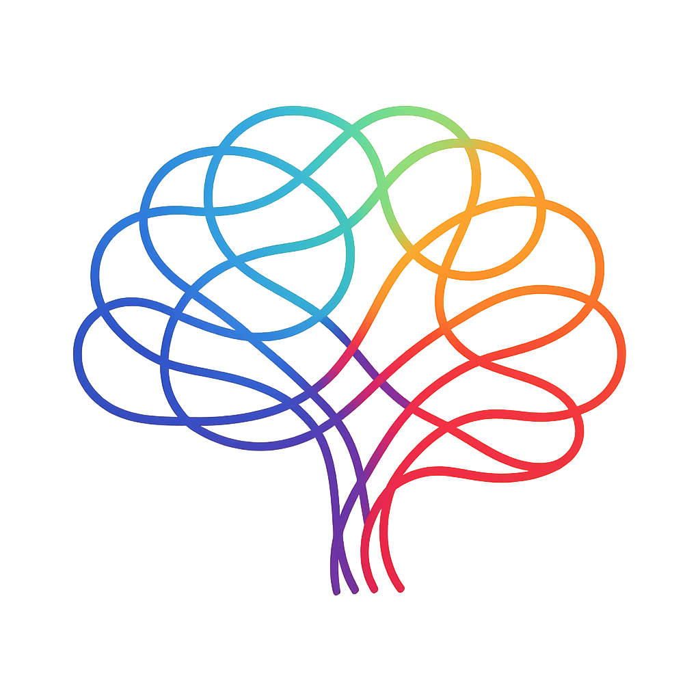

<p align="center">
  
  <h1 align="center">CoreSession</h1>
  <h3 align="center">Minimal and modern network layer for Swift.</h3>
</p>

---

### Installation

Add via **Swift Package Manager**:

```
https://github.com/yusasarisoy/CoreSession
```

---

### Example

```swift
import CoreSession

// MARK: - ExampleRequest

enum ExampleRequest {
  case fetchExampleData(_ page: Int)
}

// MARK: - ExampleData

struct ExampleData: Decodable {
    let id: Int
    let name: String
}

// MARK: - RequestProtocol

extension ExampleRequest: RequestProtocol {
  typealias Response = ExampleData
  
  var path: String {
    "YOUR_PATH"
  }
  
  var urlParams: [String: String?] {
    switch self {
    case let .fetchExampleData(page):
      let params: [String: String?] = [
        "limit": String(page)
      ]
      return params
    }
  }
  
  var requestType: RequestType {
    .GET
  }
}
```

---

### Concept

Endpoints describe **what** to request.  
The session defines **how** it’s performed.  
The decoder defines **how** it’s interpreted.

---

### License

MIT
